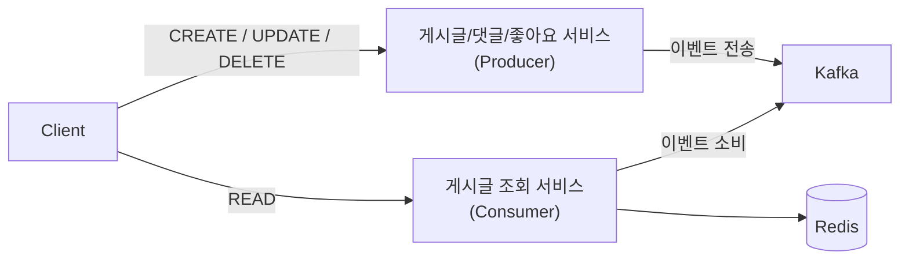
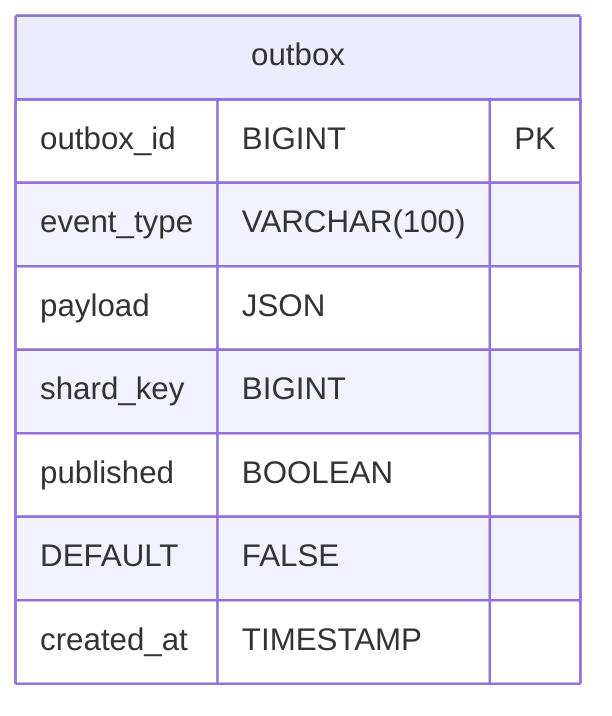
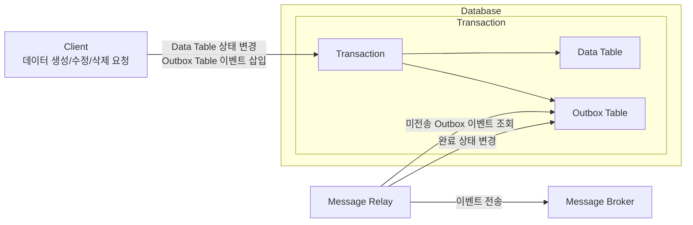
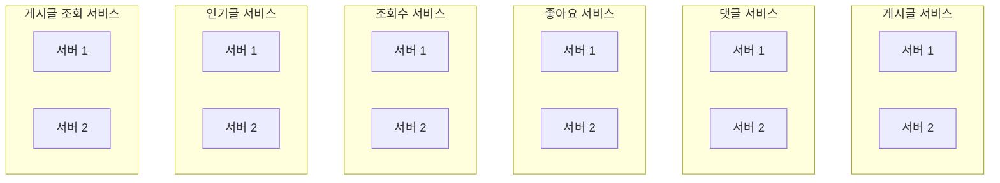
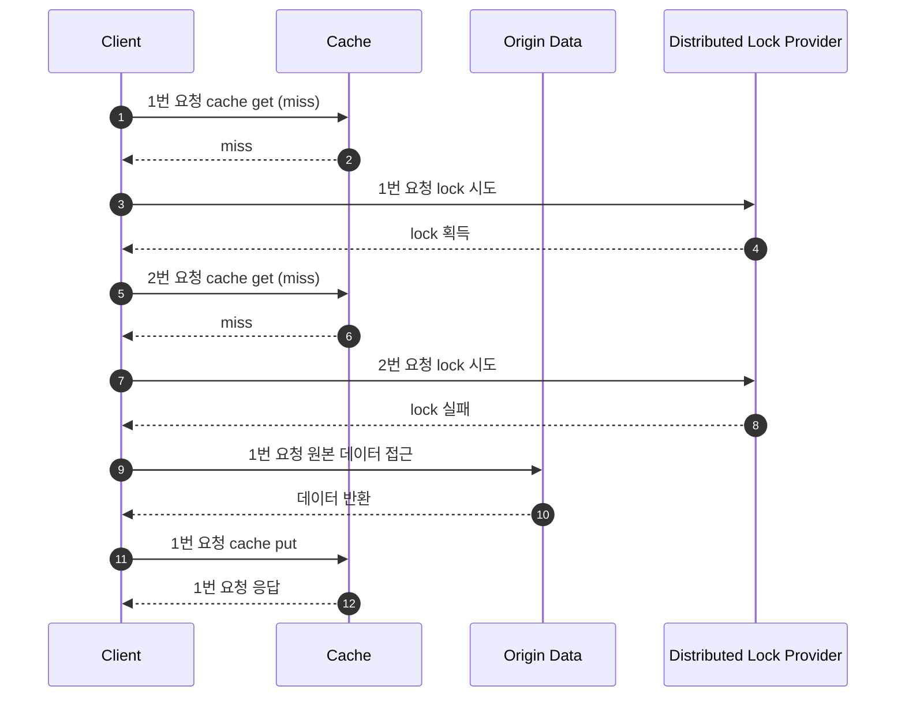

# Traffic Article

## Introduction
대규모 트래픽 환경을 고려해 설계한 게시판 시스템 프로젝트 입니다. 
서비스는 MSA 구조로 분리되어 있으며. 도메인 이벤트는 Kafka를 통해 전달되어 서비스 간 결합도를 낮추고 확장성을 높였습니다.
또한 데이터 증가와 트래픽 급증에 대응하기 위해 샤딩 전략을 고려한 테이블 구조와 Outbox 기반 이벤트 발행 방식을 적용했습니다.
읽기 기능은 별도의 Read 모델을 운영하고 Redis를 활용해 고성능 조회가 가능하도록 구성했습니다.

## Tech Stack
- Java 17
- Spring Boot 3.3.4
- Database: MySQL
- ORM: JPA
- Cache/Lock: Redis
- Messaging: Kafka

## Project Structure
```bash
common
├── data-serializer
├── event
├── outbox-message-relay
└── snowflake

service
├── article
├── article-read
├── comment
├── hot-article
├── like
└── view
```

## Architecture & Optimization Overview
### CQRS 패턴 적용
읽기 트래픽과 쓰기 트래픽을 분리하여 처리했습니다.
게시글 생성/수정/삭제 등의 Write 작업은 Write 서비스에서 처리하고,
조회 트래픽은 별도로 구성한 Article-Read 서비스에서 제공하여 데이터 접근 경로를 분리했습니다.
이를 통해 단일 DB로 집중되던 부하를 줄이고, 고성능 조회 API 구성에 유리한 구조를 확보했습니다.


### Outbox 패턴 기반 이벤트 발행
트랜잭션 내에서 데이터 저장과 이벤트 기록을 함께 수행하기 위해 Outbox 패턴을 적용했습니다.
Write 서비스는 게시글/댓글/좋아요 등 변경 데이터와 Outbox 이벤트를 한 번에 커밋하고,
별도의 MessageRelay가 Outbox를 폴링하여 Kafka로 안전하게 이벤트를 발행합니다.
이를 통해 이벤트 유실 없이 안정적인 비동기 데이터 전파 구조를 구현했습니다.




### MSA 분리 구성
게시글, 댓글, 좋아요, 조회수, 조회전용(article-read) 등 주요 기능을 개별 서비스로 분리했습니다.
서비스 간 통신은 REST + Kafka를 조합해 사용하며,
도메인 변경은 Kafka 이벤트로 전달하여 서비스 간 결합도를 낮췄습니다.
이 구조는 기능별 독립 배포가 가능하고, 장애 범위가 최소화되는 장점이 있습니다.

### 고성능 Read 모델 구성(Redis 캐싱)
Article-Read 서비스는 대규모 트래픽 상황에서도 안정적인 조회 성능을 유지하기 위해
분산락 기반의 캐시 초기화 전략 + Logical TTL/Physical TTL 분리 전략을 함께 적용했습니다.

먼저 캐시 미스가 발생하면 분산락(Distributed Lock)을 통해 단 하나의 요청만 원본 데이터를 조회하여 캐시를 갱신합니다.
이 과정에서 다른 요청들이 락을 기다리며 블로킹되지 않도록, 캐시에 실제 데이터는 남겨두되 “갱신이 필요함”만 판단할 수 있도록
Logical TTL과 Physical TTL을 분리해 관리했습니다.
- Logical TTL : 데이터의 “유효성”을 판단하는 기준
- Physical TTL : 캐시에 실제로 데이터가 삭제되는 시점

Logical TTL이 만료되어도 Physical TTL이 남아 있기 때문에,
락을 획득하지 못한 요청은 기존 캐시 데이터를 즉시 응답하고
갱신은 백그라운드에서 락을 가진 단일 요청이 수행합니다.

이 구조는
- 많은 요청이 동시에 들어와도 DB로 폭주하지 않고
- 락 대기로 인해 요청이 지연되지 않으며
- 캐시 스탬피드(Cache Stampede) 문제를 근본적으로 방지하고
- 고트래픽에서 안정적인 응답 시간을 유지할 수 있습니다.


### 샤딩 전략 고려한 DB 스키마
데이터 증가와 트래픽 확장을 대비하기 위해 게시판(boardId) 기반의 샤딩 전략을 고려한 스키마로 구성했습니다.
핵심 엔티티(article, like 등)에 board_id 또는 article_id를 샤드 키로 두어
향후 샤딩 또는 파티셔닝을 도입할 수 있는 구조를 갖추었습니다.

### 집계 테이블(Count Table)분리
좋아요 수, 조회수, 댓글 수 등을 각 기능의 메인 테이블에서 직접 증가시키지 않고
별도의 Count 테이블(article_like_count, article_comment_count 등)에 저장합니다.
이를 통해 락 경합을 줄이고,
조회 시 복잡한 COUNT 쿼리를 수행하지 않아도 되어 성능이 크게 향상됩니다.

### Kafka 기반 비동기 데이터 동기화
Write 서비스에서 발생한 모든 변경 이벤트는 Kafka 토픽으로 발행되고,
Read 서비스는 해당 이벤트를 구독하여 읽기 모델을 비동기적으로 업데이트합니다.
이 구조는 실시간성 있고 일관성 있는 조회 데이터를 유지하는 동시에
Write DB와 Read DB의 부하를 완전히 분리하는 효과가 있습니다.

#### Topic
| Topic         | Event         | Description |
|:--------------|---------------|-------------|
| BOARD_ARTICLE | board-article | 게시글 이벤트     |
| BOARD_COMMENT | board-comment | 댓글 이벤트      |
| BOARD_LIKE    | board-like    | 좋아요 이벤트     |
| BOARD_VIEW    | board-view    | 조회수 이벤트     |

## Document
#### [ERD](./doc/erd.md)
### swagger
#### [swagger guide](./doc/swagger/swagger-guide.md)
- [Article](./doc/swagger/article-docs.yaml)
- [Comment](./doc/swagger/comment-docs.yaml)
- [Like](./doc/swagger/like-docs.yaml)
- [View](./doc/swagger/view-docs.yaml)
- [HotArticle](./doc/swagger/hotarticle-docs.yaml)
- [ReadArticle](./doc/swagger/readarticle-docs.yaml)


## How To Run
Docker compose 파일을 따로 두지 않고, 개별로 실행함
필요시 컴포즈 파일로 설정 가능

### 1. Run MySQL / Redis / Kafka
#### MySQL
```bash
$ docker run --name board-mysql -e MYSQL_ROOT_PASSWORD=root -d -p 3306:3306 mysql:8.0.38 
```
#### Redis
```bash 
$ docker run --name board-redis -d -p 6379:6379 redis:7.4
```
#### Kafka
```bash 
$ docker run -d --name board-kafka -p 9092:9092 apache/kafka:3.8.0
```

### 2. Run Spring boot
```bash
./gradlew :service:<project name>:bootRun
```
