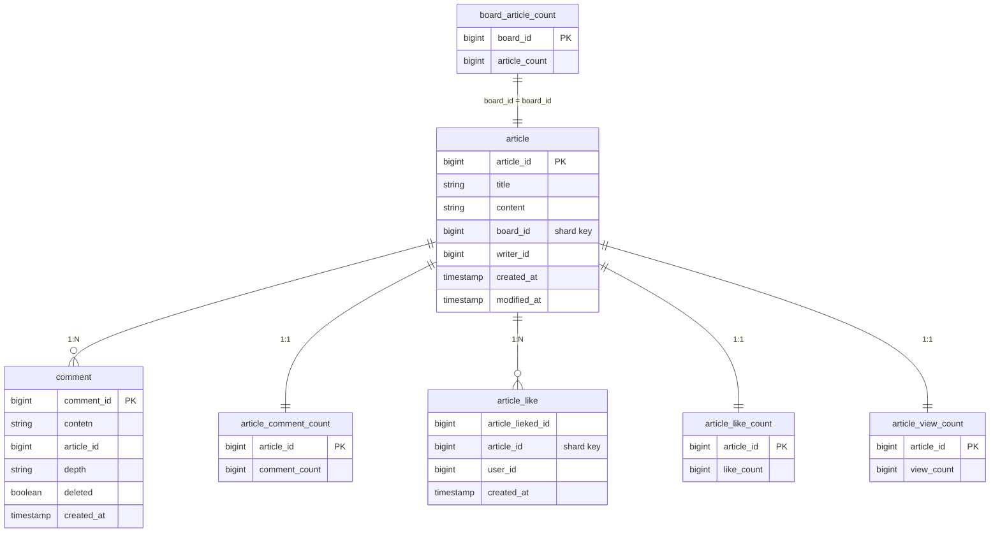

```mermaid
erDiagram
    
    article {
        bigint article_id "PK"
        string title
        string content
        bigint board_id "shard key"
        bigint writer_id
        timestamp created_at
        timestamp modified_at
    }

    board_article_count{
        bigint board_id "PK"
        bigint article_count
    }
    
    comment{
        bigint comment_id "PK"
        string contetn
        bigint article_id 
        string depth
        boolean deleted
        timestamp created_at
    }
    
    article_comment_count{
        bigint article_id "PK"
        bigint comment_count
    }
    
    article_like{
        bigint article_lieked_id
        bigint article_id "shard key"
        bigint user_id
        timestamp created_at
    }
    
    article_like_count{
        bigint article_id "PK"
        bigint like_count
    }
    
    article_view_count{
        bigint article_id "PK"
        bigint view_count
    }
    


%% ---------------------------
%% RELATIONSHIPS
%% ---------------------------

    board_article_count ||--|| article : "board_id = board_id"

    article ||--o{ comment : "1:N"

    article ||--|| article_comment_count : "1:1"

    article ||--o{ article_like : "1:N"

    article ||--|| article_like_count : "1:1"

    article ||--|| article_view_count : "1:1"

```
Article, Comment, Like, View 도메인의 기본 테이블 구조와 각 도메인 간의 관계를 표현한 것입니다.
대규모 트래픽 환경에서 안정적인 조회 성능을 확보하기 위해 **집계 테이블(comment_count, like_count, view_count)**을 별도로 두는 구조를 사용했습니다.